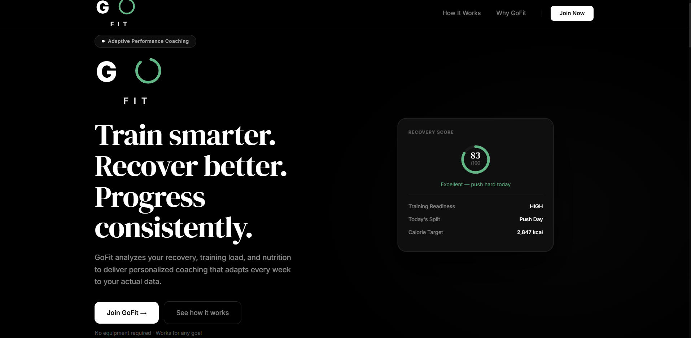
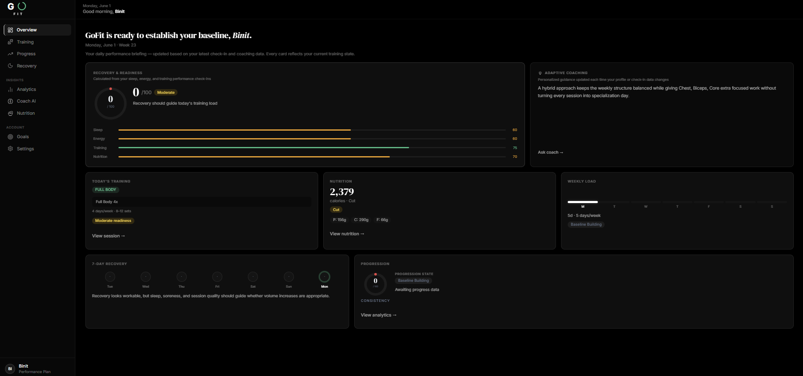
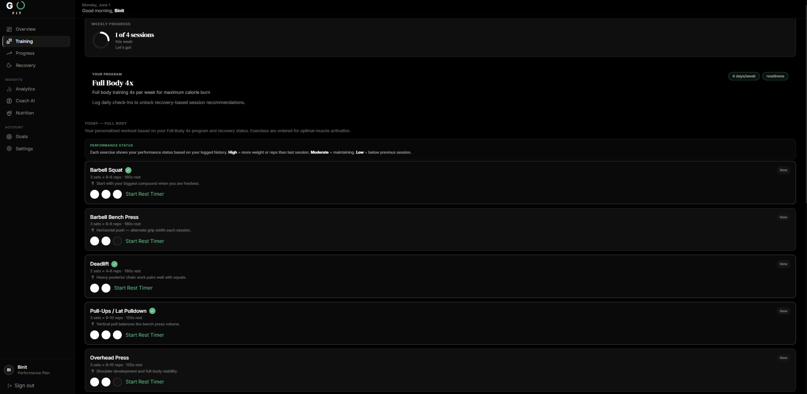
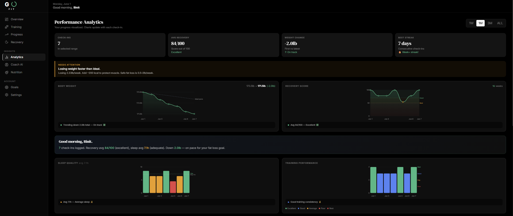

# GoFit
### Adaptive Fitness Intelligence Platform

[](https://go-fit-rho.vercel.app)
[](https://gofit-1.onrender.com/api/testing)
[](https://github.com/binitpoks-code/GoFit)


---

## Overview

GoFit is a production-grade, full-stack adaptive fitness coaching platform engineered to deliver personalized training, nutrition, and recovery recommendations that evolve dynamically with each user's performance data.

Most fitness applications function as passive data recorders — they log what you do but offer no intelligence about what you should do next. GoFit is architected differently. At its core is a **15-service coaching engine** that continuously analyzes recovery cycles, training load, fatigue accumulation, nutritional alignment, and progression trends to generate coaching recommendations that adapt week over week based on real physiological signals — not static templates.

The platform spans a complete software stack: a RESTful Java Spring Boot backend with JWT-secured endpoints, a normalized PostgreSQL schema, a React 19 and TypeScript frontend with custom SVG analytics, and a containerized deployment pipeline across Render, Vercel, and Supabase.

---

## Live Deployment

| Resource | URL |
|----------|-----|
| Frontend Application | https://go-fit-rho.vercel.app |
| Backend REST API | https://gofit-1.onrender.com |
| API Health Check | https://gofit-1.onrender.com/api/testing |

> The backend is hosted on Render free tier and may require up to 60 seconds to cold-start on first request.

**Demo Account**

| Field | Value |
|-------|-------|
| Email | demo@gofit.app |
| Password | demo123 |

---

## Screenshots

### Landing Page
The public-facing landing page communicates GoFit's core value proposition with a premium dark aesthetic. Authenticated users are redirected directly to their dashboard.



### Dashboard — Performance Briefing
The dashboard delivers a daily performance briefing driven entirely by live coaching data. Every card reflects the user's current recovery state, training readiness, nutritional alignment, and progression status — updated automatically with each check-in submission.



### Training — Adaptive Session Planner
The training page presents the user's personalized session for the day, derived from their selected training split and adjusted by their current recovery score. Each exercise card includes set completion tracking, rest timer functionality, and a performance status indicator calculated from logged training history.



### Performance Analytics
The analytics module visualizes weight trend, recovery score trajectory, sleep quality, and training performance across all logged check-ins. Each chart is paired with a programmatically generated coaching note that interprets the trend in plain language — identifying patterns such as water retention events, plateau formations, and recovery correlations.



---

## Why GoFit Is Different

Generic fitness applications store data. GoFit interprets it.

The distinction is architectural. Rather than presenting raw numbers to the user and expecting them to draw conclusions, GoFit routes all user data through a layered coaching engine that applies domain-specific logic across 15 independent services. The output is not a chart — it is a coherent, context-aware recommendation that accounts for the user's goal, their recent recovery quality, their training history, and their nutritional alignment simultaneously.

This approach was a deliberate engineering decision. Separating coaching logic into discrete services — each owning a single domain such as plateau detection, deload scheduling, or calorie strategy — means that recommendations remain accurate, auditable, and independently modifiable as the platform evolves.

---

## Core Platform Features

**Adaptive Coaching Engine**
A 15-service backend intelligence layer that processes user profile data, weekly check-ins, training history, and recovery metrics to produce personalized coaching outputs. Recommendations recalibrate every 7 days based on incoming physiological data.

**Recovery Cycle Intelligence**
Users complete daily check-ins across three dimensions: energy level, training performance, and sleep quality. After 7 consecutive entries, the platform unlocks a composite weekly recovery score and adjusts training intensity guidance, deload recommendations, and progression strategy accordingly.

**Precision Nutrition Targeting**
Daily calorie targets are computed using the Mifflin-St Jeor Total Daily Energy Expenditure formula, factoring in biological sex, age, height, body weight, and activity level. Macro distribution across protein, carbohydrates, and fat is derived programmatically from the user's active goal phase.

**Training Program Architecture**
Eight scientifically structured training splits matched to the user's goal, weekly availability, and experience level via a rule-based recommendation engine. Programs include Full Body, Upper Lower, Push Pull Legs, Classic Bro Split, Arnold Split, 5/3/1 Strength, PPL Strength, and Full Body 4x.

**Progressive Overload Planning**
A built-in progressive overload calculator generates week-by-week strength progression plans from current working weight to goal weight, incorporating automatic deload weeks, exercise-type-specific increment logic, and plateau-buster recommendations.

**One-Rep Max Estimation**
The 1RM calculator applies both the Epley and Brzycki formulas and averages the results for improved accuracy. Outputs include estimated max and training zone breakdowns across strength, hypertrophy, volume, and endurance percentages, benchmarked against population-level strength standards segmented by biological sex and bodyweight ratio.

**Performance Analytics**
Custom SVG-based data visualizations display weight trend, recovery score trajectory, sleep quality, and training performance over time. Each chart is accompanied by a programmatically generated coaching note that contextualizes the trend in plain language.

---

## Technical Architecture

```
┌──────────────────────────────────────────────┐
│              React 19 Frontend               │
│      TypeScript · Tailwind CSS · Vite        │
│          Custom SVG Analytics Layer          │
│           JWT Interceptor · Axios            │
└─────────────────────┬────────────────────────┘
                      │ HTTPS · JWT Bearer Token
┌─────────────────────▼────────────────────────┐
│           Spring Boot REST API               │
│                                              │
│          15-Service Coaching Engine          │
│                                              │
│    RecoveryScoreService                      │
│    FatigueAnalysisService                    │
│    WorkloadMonitoringService                 │
│    PlateauDetectionService                   │
│    DeloadRecommendationService               │
│    ProgressionStrategyService                │
│    ConsistencyScoringService                 │
│    CalorieStrategyService                    │
│    NutritionTargetService                    │
│    SplitRecommendationService                │
│    AdaptiveAdjustmentService                 │
│    TrainingReadinessService                  │
│    ProgressAnalysisService                   │
│    CoachingInsightService                    │
│    CoachingMemoryService                     │
│                                              │
│    Controller → Service → Repository        │
│    GlobalExceptionHandler                    │
│    JWT Filter · BCrypt · SecurityConfig      │
└─────────────────────┬────────────────────────┘
                      │
┌─────────────────────▼────────────────────────┐
│           PostgreSQL · Supabase              │
│                                              │
│    UserAccount       UserProfile             │
│    ProgressEntry     UserGoal                │
│    WorkoutPlan       Exercise                │
└──────────────────────────────────────────────┘
```

---

## Technology Stack

### Backend
| Technology | Version | Role |
|------------|---------|------|
| Java | 17 | Core application language |
| Spring Boot | 4.0.6 | REST API and application framework |
| Spring Security | 7.x | Authentication and authorization |
| Hibernate and JPA | 7.x | ORM and database abstraction |
| PostgreSQL | 14+ | Relational data persistence |
| JWT (jjwt) | 0.12.x | Stateless token-based authentication |
| BCrypt | — | Password hashing |
| Docker | — | Container image and deployment |
| Maven | 3.8+ | Dependency management and build |

### Frontend
| Technology | Version | Role |
|------------|---------|------|
| React | 19 | Component-based UI framework |
| TypeScript | 5.x | Static typing and developer tooling |
| Tailwind CSS | 4.x | Utility-first styling system |
| Vite | 8.x | Frontend build tooling |
| Axios | — | HTTP client with JWT interceptors |
| Recharts | 2.15 | Charting library |
| Lucide React | — | Icon system |

### Infrastructure
| Service | Role |
|---------|------|
| Render | Dockerized backend hosting |
| Vercel | Frontend CDN and deployment |
| Supabase | Managed PostgreSQL database |
| GitHub | Version control and CI/CD triggers |
| UptimeRobot | Backend uptime monitoring |

---

## REST API Reference

| Method | Endpoint | Auth | Description |
|--------|----------|------|-------------|
| POST | /api/auth/register | Public | Register new user account |
| POST | /api/auth/login | Public | Authenticate and receive JWT |
| PUT | /api/auth/change-password | JWT | Update account password |
| GET | /api/profiles | JWT | Retrieve profile and coaching output |
| POST | /api/profile | JWT | Create or update user profile |
| GET | /api/progress | JWT | Retrieve full check-in history |
| POST | /api/progress | JWT | Submit daily check-in |
| PUT | /api/progress/{id} | JWT | Modify existing check-in entry |
| DELETE | /api/progress/{id} | JWT | Remove check-in entry |
| GET | /api/goals | JWT | Retrieve goal history |
| POST | /api/goals | JWT | Set or update active goal |
| GET | /api/workouts | JWT | Retrieve training plans |
| POST | /api/workouts | JWT | Save selected training program |
| GET | /api/testing | Public | Coaching scenario demos |

---

## Database Schema

```sql
UserAccount
  id · username · email · password_hash · created_at

UserProfile
  id · user_id · age · weight · height · gender
  activity_level · experience_level · training_days
  weekly_weight_target · goal · weak_area
  coaching_output (JSON)

ProgressEntry
  id · user_id · date · body_weight
  fatigue_level · workout_performance
  sleep_hours · energy_level · notes

UserGoal
  id · user_id · goal_type · focus_areas
  created_at · is_active

WorkoutPlan
  id · user_id · workout_name
  muscle_group · training_days · created_at

Exercise
  id · name · sets · reps · rest_seconds
  muscle_group · workout_plan_id
```

---

## Local Development Setup

### Prerequisites
- Java 17+
- Node.js 18+
- PostgreSQL 14+
- Maven 3.8+

### Clone and Configure

```bash
git clone https://github.com/binitpoks-code/GoFit.git
cd GoFit
```

### Backend

```bash
cd backend
cp src/main/resources/application.example.properties \
   src/main/resources/application.properties
```

Update `application.properties`:

```properties
spring.datasource.url=jdbc:postgresql://localhost:5432/gofit
spring.datasource.username=your_db_user
spring.datasource.password=your_db_password
gofit.jwt.secret=your_jwt_secret_minimum_32_characters
gofit.cors.allowed-origins=http://localhost:5173
```

```bash
./mvnw spring-boot:run
# API available at http://localhost:8080
```

### Frontend

```bash
cd frontend
npm install
```

Create `frontend/.env`:

```
VITE_API_BASE_URL=/api
```

```bash
npm run dev
# Application available at http://localhost:5173
```

---

## Engineering Decisions

**Why 15 separate coaching services?**

Each service owns a single, well-defined domain of coaching logic — recovery scoring, plateau detection, deload timing, calorie strategy, and so on. This separation of concerns means each service is independently testable, independently modifiable, and does not carry the cognitive overhead of a monolithic coaching class. When business logic changes — for example, adjusting the deload threshold — only the relevant service is touched. This architecture also makes the codebase significantly easier to reason about during debugging and future development.

**Why JWT over session-based authentication?**

GoFit is designed as a stateless API that decouples the frontend deployment from the backend. JWT tokens allow the React frontend hosted on Vercel to authenticate against the Spring Boot backend on Render without shared session state, making the architecture horizontally scalable and infrastructure-agnostic. Token expiry is handled client-side using jwtDecode before requests are dispatched, preventing unnecessary round trips for expired sessions.

**Why custom SVG charts instead of a charting library?**

Recharts and similar libraries wrap SVG rendering in React components that rely on ResizeObserver and dynamic container measurements. In production deployments with specific viewport constraints, these can silently collapse to zero height. Custom SVG with explicit viewBox dimensions and preserveAspectRatio guarantees correct rendering across all environments without dependency on container measurement APIs.

**Why Docker for backend deployment?**

Containerizing the Spring Boot backend ensures that the runtime environment on Render is identical to the local development environment. It eliminates dependency conflicts, Java version mismatches, and configuration drift between environments — all common failure points in production Java deployments.

---

## Roadmap

- Wearable device integration for real HRV-based recovery scoring
- In-app AI coaching chat interface
- Barcode scanner for meal logging and nutrition tracking
- React Native mobile application
- Social layer for training partner accountability

---

## Author

**Binit Pokharel**
Graduating CS and IT Student · Full Stack Developer

- GitHub: [binitpoks-code](https://github.com/binitpoks-code)
- LinkedIn: [binit-pokharel](https://www.linkedin.com/in/binit-pokharel-b342a7251)
- Live Project: [go-fit-rho.vercel.app](https://go-fit-rho.vercel.app)

---

*GoFit is a portfolio project built to demonstrate production-grade full-stack engineering across backend architecture, API design, database modeling, frontend development, and cloud deployment.*
